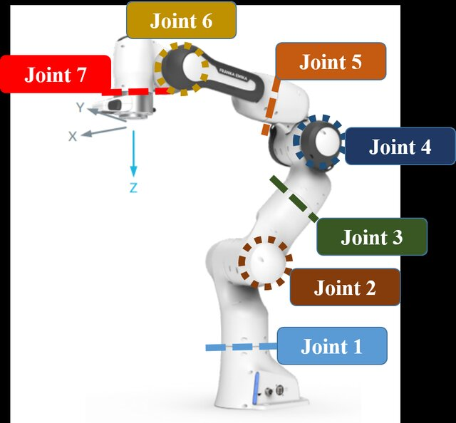
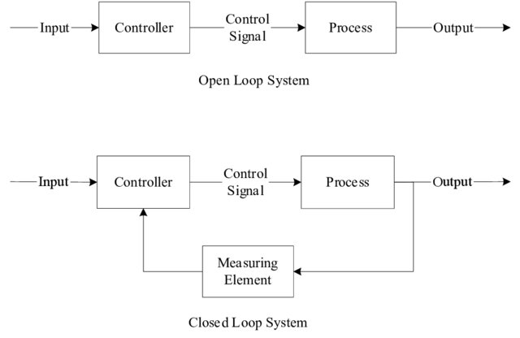
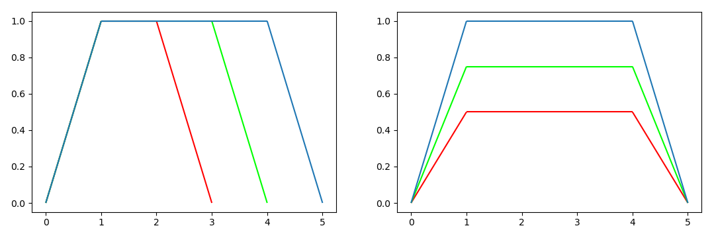

# Manipulator Motion Control

This tutorial is for learning the basics with pyBullet and how to control a 
manipulator arm like the Franka Panda Robot.

You find some code to start in the `main.py` and the tasks are described here.
Please also refer to the [PyBullet Quickstart Guide](https://docs.google.com/document/d/10sXEhzFRSnvFcl3XxNGhnD4N2SedqwdAvK3dsihxVUA/)
for further explanations on the basic PyBullet functions.

## 1: Understanding the `main.py` and URDF files

Please take some time to get familiar with the existing code in the `main.py`.

### What it does so far:
- connect to the physics simulation using `p.connect()`
- configure gravity
- load a ground plane from the [URDF file](https://github.com/bulletphysics/bullet3/blob/39b8de74df93721add193e5b3d9ebee579faebf8/examples/pybullet/gym/pybullet_data/plane.urdf)
- load the Franka Panda robot from the [URDF file](https://github.com/bulletphysics/bullet3/blob/39b8de74df93721add193e5b3d9ebee579faebf8/examples/pybullet/gym/pybullet_data/franka_panda/panda.urdf)
- calling a `simulate()` method, which wraps around pyBullet's `stepSimulation()` method to progress the simulation

When you run the script (`python main.py`), it will open up the simulator GUI.
It waits for you to hit Enter and then starts to simulate.
You will notice how the robot moves a little.
If you simulate long enough, it eventually falls - due to gravity. Whoops!
Let's take a closer look.

(You can stop the program by hitting Ctrl+C in the terminal if you don't want to wait for it to finish.)

### Understanding URDF - links and joints

URDF stands for Unified Robotics Description Format.
URDF files are XML files that contain a physical description of a robot.
It is structured into *links* - a single rigid body - and *joints* - connectors
between the links.

Now, you may wonder, why is the ground plane described by URDF? Is it a robot?

Of course not, but in the wider sense, it can be described with links and joints.
If you look at the URDF file above, you will notice that it has only one link and 
no joints. That makes sense, as it cannot move.
Essentially, you can describe any (rigid) (multi-)body with URDF files.

If you inspect the file even closer, you will notice that some phsyical properties
like friction are also configured. You may notice the tag
`<mass value=".0"/>` - a mass of zero essentially means that the object is fixed in
space and hence cannot move. Any object with a non-zero mass is automatically loaded
as movable object (such as our robot - that's why it falls).

If you look at the robot's URDF file, you will see a lot more links and joints.
The Franka Panda Robot in particular is a 7-DoF (degrees of freedom) arm. 
This means it has 7 joints that it can control to change the configuration of
the arm. The URDF also describes the gripper, which is a two-finger gripper.
Both fingers can be controlled with a joint, which makes a total of 9 DoF.
Note that the URDF file states some more joints of type "fixed", these are 
just to connect two links in a rigid manner - without adding a DoF.

Tip: From the `util.py` module, use the function `print_joint_info(robot_id)` to
display some more information about the robot's joints.

### Fixing the robot

We learned that every object with a non-zero mass is automatically loaded as 
movable object.
Although our robot has a mass, we would like it to be fixed.

Check the [PyBullet Quickstart Guide](https://docs.google.com/document/d/10sXEhzFRSnvFcl3XxNGhnD4N2SedqwdAvK3dsihxVUA/)
to see how to modify the following command so that the base of the robot is fixed in space. 
```
robot_id = p.loadURDF('franka_panda/panda.urdf')
```

Implement the change and see if it stays static this time.

Hint: the Python values for `True` and `False` are interpreted as `1` and `0`, so
you do not need to provide actual integer values.

## 2: Understanding the joint values

Our robot should have a static base now, but the initial configuration is a 
bit awkward.
Perhaps we can put the robot in a more suitable configuration before the start of 
the simulation.

As mentioned before, the arm has 7 DoF.
These are illustrated in the following figure:



(Image from [Ho et al. (2022)](http://dx.doi.org/10.1109/ACCESS.2023.3234104))

### Joint range / limits

Each joint has a certain range that it can move in.
This is based on the real robot and defined in the URDF file.
You may have noticed that `lower limit` and
`upper limit` will be shown when you use `print_joint_info(robot_id)`.
For example, the first joint has a lower limit of -2.9671 and an upper limit of
2.9671. 
As the joints are revolute joints, the values are in radian. 
A value of $\pi$ (3.1415) equals to 180 degree.

The limits of our arm joints as per the URDF file are the following:

| joint | 1       | 2        | 3       | 4       | 5        | 6        | 7        |
|-------|---------|----------|---------|---------|----------|----------|----------|
| lower | -2.9671 | -1.8326  | -2.9671 | -3.1416 | -2.9671 | -0.0873 | -2.9671 |
| upper | 2.9671  | 1.8326   | 2.9671  | 0.0     | 2.9671  | 3.8223  | 2.9671  |


In robotics applications, we typically do not want to operate the robot close to its joint limits.
Many algorithms therefore try to avoid them on purpose.
When loading the robot into pybullet, the joint states default to zero.
Inspecting the range of the joints, this means that in the "all-zero" configuration joint 4 and joint 6 are actually at or close to their limit.

### Resetting the joint states

Let's reset the joint states before the start of the simulation so that the robot is in a suitable configuration.
A typical starting configuration for the Franka Panda robot would be the following:

```python
ROBOT_HOME_CONFIG = [0.0, -0.7854, 0.0, -2.3562, 0.0, 1.5708, 0.7854]
```

Note how each joint is well within its limits.
This is a pose where the robot is ready to move in any direction and the gripper is at the front and pointing exactly downwards.
Let's implement it.

The home configuration is already defined in `util.py`.
The indices of the joint values in the list correspond to the joint indices from the URDF.
For setting the joint angles, we can use pyBullet's function `resetJointState()` as follows:
```python
p.resetJointState(robot_id, joint_id, target_joint_value)
```

Write a loop that sets all joint angles according to the home configuration - this should be after the robot is loaded, but before the simulation is started.

Note that `resetJointState()` is a hard reset - you should never do this inbetween calls to `stepSimulation()`, as information about the velocities, forces, etc. will be inconsistent.

To make the robot move, we instead have to use the joint motors.


## 3: Joint motor control

To make the robot move, we actually need to control the motors!
In robots, we typically have [servomotors](https://en.wikipedia.org/wiki/Servomotor). 
PyBullet offers functions for low-level motor control, including velocity control, position control, or force/torque control.
The function `p.setJointMotorControl2()` covers all of those cases.
In this tutorial, we will only touch upon velocity and position control.



Essentially, we have a closed-loop control system, where the input/output is position and/or velocity.
The "process" in the picture is our motor.

### Stay where you are

In PyBullet's Quickstart Guide, it states that "by default, each revolute joint and prismatic joint is motorized using a velocity motor" - this controls towards a joint velocity of 0 and therefore makes our robot actually stand still.

Let's try to see what happens if we disable that! We can do this by setting the force of each joint motor controller to zero:

```python
for joint_id in range(7):
    p.setJointMotorControl2(
        robot_id, 
        joint_id, 
        controlMode=p.VELOCITY_CONTROL, 
        force=0
    )
```

See how the robot is suddenly falling to the ground immediately as the simulation starts?
Effectively, PyBullet's preset made our robot counter gravity and stay where it is.

Note that in contrast to the `resetJointState()` method, the `setJointMotorControl2()` method can also be called while the simulation is running (i.e., inbetween steps).
It will then apply to all following simulation steps until another call to the function overrides the controller.

### Using velocity control to move

Let's use velocity control for something more useful than making our robot fall. :)

Instead of the above code, let's control the first joint to actually move with a certain target velocity.
Try the following:
```python
joint_id = 0
p.setJointMotorControl2(
    robot_id, 
    joint_id, 
    controlMode=p.VELOCITY_CONTROL,
    targetVelocity=1,
    force=100
)
```

Note how we additionally provided the property `targetVelocity`.
You will see that the joint moves at the desired velocity, unless you set it too high.
However, at some point it simply stops - because it arrives at the joint limit. 

If we want to move the joint to a particular position, we would need to constantly check whether we are there already, and if yes, set the target velocity to zero again.

### Checking the joint state

The check where we currently are, pyBullet has the function `getJointState()`.
It returns a list, of which the first element is the joint position (see the Quickstart Guide).

The procedure for moving the joint to a target position of 1 could look as follows:
- set target velocity to 1
- get joint position
- while joint position < 1 (target position)
  - simulate one step
  - get joint position
- set target velocity to 0

Go ahead and implement this in your script.

Discuss: How well does it work? Do you arrive accurately at your target position of 1?

### Using position control to move

Instead of velocity control, we can also use position control to move towards a target position.
The controller directly uses the error between the current and the target position to drive the system towards the target.
Hence, this should be more accurate than what we've tried before.
You may have noticed that we overshot our goal and ended up with a position slightly above 1.


Let's now implement position control instead.
The command should look as follows:
```python
joint_id = 0
p.setJointMotorControl2(
    robot_id, 
    joint_id, 
    controlMode=p.POSITION_CONTROL,
    targetPosition=1,
    force=100
)
simulate(seconds=10)
```

You do not need to keep track the joint position anymore, as the controller will automatically make the robot stay in the target position.
The code therefore looks a bit simpler.

If you look closely, you notice that the robot moves extremely fast initially, and then slows down as it reaches the goal.
This is due to the position controller only amplifying the error between current position and target to determine the motor force.

Position control can in fact incorporate a target velocity as well, and use both errors (difference in position as well as difference in velocity) to drive the motor.
However, this needs a suitable configuration of the position gain and velocity gain parameters and delves into the field of control engineering.

Here, we will simply limit the maximum velocity to achieve a relatively smooth motion.
Add the argument `maxVelocity=1` to the above command.

### Move all joints

Write a function `move_to_joint_pos()` that gets the robot's body id and a target joint configuration (list of all seven joint positions) as input and controls the robot to move to that configuration.
Use position control with a maximum velocity.

The function should call `simulate()` by itself, check the joint state after each step, and return when the position is approximately achieved.
You can use the function `get_arm_joint_pos()` from the `util` module to retrieve the values for all joints in a list.
To compare the current joint positions with the target joint positions, use the `numpy` function `np.allclose()` with a custom absolute tolerance of 0.0001 as so:
```
np.allclose(current_joint_pos, target_joint_pos, atol=0.0001)
```
It will return `True` if all values are less than `atol` apart.

Having such a `move_to` function is pretty cool, because later on you can simply call the function to move anywhere you want, and your high-level code will look very clean and intuitive - all the low-level code is encapsulated in this function.

Let's try this right away.
Adjust your main function so that it calls the `move_to_joint_pos()` and moves the robot through three different poses of your choice.
It should look like so:
```
while True:
  move_to_joint_pos(configuration1)
  move_to_joint_pos(configuration2)
  move_to_joint_pos(configuration3)
  ```

Well done!
You have now implemented a simple PTP (point-to-point) motion controller. 

### Going further: Synchronised PTP

If you look closely to your robot moving around, you will notice that some joints arrive at the target position earlier than other joints.
To achieve a smoother motion, we typically use what is called a synchronised PTP. 

In synchronised PTP, only the joint that travels the furthest uses the maximum velocity.
We reduce the velocity of the other joints such that they will arrive at their target at the same time.
The following figure illustrates that. 
It shows the velocity profile of a 3-DoF robot over time for one PTP motion, the joints are color-coded.
On the left, you see the non-synchronised version, and on the right, you see the synchronised version where we reduce the velocity accordingly.




Adjust your `move_to_joint_pos()` function such that it calculates the appropriate velocity for each joint.
The pseudo code would be:
```
max_velocity := 1
distances := element-wise difference between current joint positions and target joint positions
max_dist := max(distances)
for each joint:
  max_vel[joint] := distances[joint] / max_dist * max_velocity
```

Note that some of the operations might be easier if you convert the lists of joint positions to numpy arrays.

If you look at the robot motion again, you will find that it operates much smoother than before!
That's great.
You have now implemented a Synchronised PTP motion controller.

### Synchronised PTP in practice

In simulation, our synchronsied PTP implementation works perfectly fine.
However, on a real robot, we must also consider the stress on the joints and motors, as a high stress wears out the joints and over time makes the robot less accurate.
In high-precision tasks such as automotive manufacturing, we really don't want that!

In practice, we would therefore control more finely the start and the end of the trajectory.
If you look at the synchronised PTP velocity profile above, you can see that we have a starting phase in which the velocity increases and a final phase where the velocity decreases again.
But the profile has sharp bends, which means it is not differentiable at some points.
We will therefore have jumps in the acceleration, specifically at time steps 0, 1, 4 and 5.
These jumps are bad for the motors - they can only change smoothly, and if our controller wants them to change the acceleration immediately, it will quite literally stress them.
We can alleviate this by smoothening the bends in the above velocity profile and therefore making it differentiable.
The acceleration profile will then be continuous (but have some bends).
Ideally, we also smoothen this acceleration profile so that this in turn is differentiable.
It reduces the [jerk](https://en.wikipedia.org/wiki/Jerk_(physics)) (which is the derivative of the acceleration).
Motions with minimal jerk are not only best for the joints/motors but are also perceived as very smooth by humans.
(Think of an elevator - when it starts/stops, it can sometimes feel jerky - that's exactly the same effect.)

### Wrap Up

So, this was a tutorial on joint motor control.
You learned:
- how a robot can be described with links and joints in a URDF file
- how to load the robot in pyBullet, make it static, and reset joint values
- how to use a velocity controller and a position controller to control individual joints
- how to make the robot move to a joint position using PTP and synchronised PTP motion control

Now, the motion control that we implemented so far has a few limitations:
1. We do not have much control over the position and orientation of our end effector (the end bit of the robot where the gripper is attached). You can imagine tasks where we would like to move the gripper to a particular position (in *task* space), or maybe we would even like to follow particular trajectories with the gripper, like a straight line or an arc. This is e.g. important for welding or painting tasks. To accomplish this, we will have to learn more about the *kinematics* of our robot, which will allow us to perform *task space motion control*.
2. Our motion controller did not consider any obstacles. In order to avoid obstacles, you would need to introduce intermediate waypoints for the robot to go to. The controller is deterministic, so if your trajectory with waypoints works, you can simply repeat it (assuming the environment does not change). That's how most industrial robots are programmed: To do exactly the same task repeatedly and fast. Algorithms that automatically find collision-free waypoints in an environment with obstacles are so-called *motion planning* methods.
